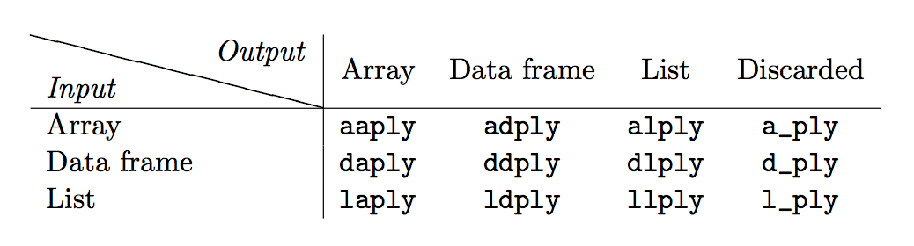

```{r setup, include=FALSE}
knitr::opts_chunk$set(echo = TRUE, eval=FALSE)
```

# Content

* [Functions](#functions)
* [Pipes and pipe operator](#pipes-and-pipe-operator)
* [Data manipulation](#data-manipulation)
* [The split-apply-combine strategy](#the-split-apply-combine-strategy)

# Functions

* Define a function:

```{r}
my_function = function(x, y, z, ...) {
  ## some code
  
  ## some other code
}
```


* Call the function

```{r}
my_function(x=VALUE, y=VALUE, z=VALUE)
```


* Example: define a function to extract all columns between two column names from a data frame. 

```{r}
## load data
pbsc = read.csv('PBSC-comma.txt', header = TRUE)

## we can get multiple columns by position
pbsc[2:4]

## get columns by names
get_columns_by_names = function(my_data_frame, first_name, last_name) {
  df_column_names = colnames(my_data_frame)
  first_position = which(df_column_names == first_name)
  last_position = which(df_column_names == last_name)

  my_data_frame[first_position:last_position]
}

## call the function
get_columns_by_names(pbsc, "A", "C")
get_columns_by_names(pbsc, "C", "A") # reversed
```


* Anonymous functions
    + Functions that don't have a name.
    + Usually used to create a closed environment for running some code.
    
```{r}
function(x, y, z, ...) {
  ## some code
  
  ## some other code
}

# will show you a use case in next section.
```


# Pipes and pipe operator

A pipe is a sequence of operations. It reflects the data and analysis flow.

The pipe operator `%>%` comes from the package **magrittr** by Stefan Milton Bache.

```{r}
# install.packages('magrittr')
# install.packages('dplyr')
library(dplyr)
pbsc %>% 
  head() %>% # the output from the previous operator will be the first argument in the next operator/function
  `[`(2:4) # yes! '[' is a function.

# the normal way to do this.
`[`(pbsc, 2:4) 

# use anonymous function in pipes
workshop_comment = 'I really do not like the RNASeq workshop!'
gsub('do not', 'do', workshop_comment)

workshop_comment %>%
  gsub('do not', 'do')  # this won't work because it takes workshop_comment as its first argument.


workshop_comment %>% 
  (function(comment) {
    gsub('do not', 'do', comment)
  })

```


# Data manipulation

We are going to learn five important functions from the **dplyr** package. These five functions allows you
to do a vast majority of data manipulation.

* `filter()`: filter rows
* `select()`: select variables by names
* `arrange()`: reorder the rows
* `mutate()`: create new variables by modifying existing variables
* `summarise()`: collapse many values down to a single summary

Here variables refer to data frame columns.

## Filter rows with `filter()`

`filter()` filters data frame by the logical values of expressions on columns. The first argument
is a data frame. The second and subsequent arguments are expressions.

```{r}
# load the library first
library(dplyr) 

pbsc
filter(pbsc, G > 25)
filter(pbsc, G > 25, A > 25) # it can takes multiple expressions
filter(pbsc, X.Base %in% 2:5 ) # get values from base 2 to 5

# what does the logical values of expressions mean?
pbsc$G > 25
pbsc$G >25 & pbsc$A > 25
pbsc$X.Base %in% 2:5

# filter NA rows
pbsc_na = pbsc
pbsc_na$phred = sample(c(20:60, rep(NA, 10)), nrow(pbsc_na), replace = TRUE)
pbsc_na

pbsc_na %>%
  filter(is.na(phred)) # select all rows that phred is NA

pbsc_na %>%
  filter(!is.na(phred)) # select all rows that phred is not NA
```


## Select columns by names with `select()`

```{r}
# select columns by names
select(pbsc, G, A)

# select all columns between G and C
select(pbsc, G:C)

# select all columns except those from G to C
select(pbsc, -(G:C))

# more cool stuff
iris

select(iris, starts_with('Sepal')) # names begin with 'Sepal'
select(iris, ends_with('Length')) # names end with 'Length'
select(iris, contains('al')) # names that contain 'al'
select(iris, matches("\\.")) # select by a regular expression
```


## Reorder rows with `arrange()`

```{r}
iris
arrange(iris, Petal.Length)
arrange(iris, Petal.Length, Petal.Width) # sort by multiple columns

arrange(iris, desc(Petal.Length)) # descending order
```


## Create new variables with `mutate()`

```{r}
mutate(pbsc, 
       GC = G + C,
       AT = A + G)


# refer to columns that you've just created
mutate(pbsc,
       GC = G + C,
       AT = A + G,
       GA_to_AT = GC/AT)

# if you only want to keep the new variables, use transmutate().
transmute(pbsc,
          GC = G + C,
          AT = A + G,
          GA_to_AT = GC/AT)

# a use case of combining multiple manipulating functions
#  goal: select rows that are GC biased
mutate(pbsc,
       GC = G + C,
       AT = A + G,
       GC_bias = GC > AT) %>%
  filter(GC_bias)
```


## Operating on subsets of a data frame with `summarise()`

`summarise()` is similar to `mutate()`. You operate on existing variables to new variables. But the new variables
have to be one single value.

```{r}
summarise(pbsc, GC = G + C) # this won't work because the new variable has length > 1

summarise(pbsc, average_G = mean(G)) # calculate the average of G content.

```

`summarise()` is usually used with `group_by()`. The `group_by()` converts a data frame to
a grouped table. So operations can be performed on data frame by group.

```{r}
mtcars

grouped_mtcars = group_by(mtcars, cyl)
grouped_mtcars # what does the data look like now?

class(grouped_mtcars) # now it is a 'grouped_df' object.

summarise(grouped_mtcars, mean(mpg)) # calculate average mpg for each number of cyl.

# we can group the data by multiple variables.
group_by(mtcars, cyl, gear, carb) %>%
  summarise(mean(mpg), max(disp), min(wt))
```


# The split-apply-combine strategy

The split-apply-combine strategy is designed for parallel environment. You split your data into small pieces, apply a function to each pieces, and then combine the results to get your final results.

The 12 key functions of package **plyr** that implement the split-apply-combine strategy:




## The `a*ply` functions

Three common ways to split an array. A matrix is a two dimensional array, and a vector is a one dimensional array. In most situation, you will apply the `a*ply` functions to a mtrix.

There are three common ways to split a matrix:
* split by row
* split by column
* split by row and column

```{r}
# install the plyr package if you haven't.
# install.packages('plyr')
library(plyr)
```

Example 1: calculate averages for each columns in data `mtcars` (split by column)

```{r}
# the data we use
mtcars

# split by column
mtcars_matrix = as.matrix(mtcars) # convert data frame to matrix
aaply(.data=mtcars_matrix, .margins=2, .fun=mean) # output is array
adply(.data=mtcars_matrix, .margins=2, .fun=mean) # output is data frame
alply(.data=mtcars_matrix, .margins=2, .fun=mean, .dims=TRUE) # output is lit
a_ply(.data=mtcars_matrix, .margins=2, .fun=mean) # nothing returned
```


Example 2: convert absolute values to relative values (split by row). 

```{r}
mtcars_t = t(mtcars) # transpose the data
head(mtcars_t) 

# split the matrix by row, and then divide each element by the largest value from that row.
aaply(.data=mtcars_t, .margins = 1, function(x){x/max(x)} )
adply(.data=mtcars_t, .margins = 1, function(x){x/max(x)} )
alply(.data=mtcars_t, .margins = 1, function(x){x/max(x)}, .dims = TRUE )
```


Example 3: split by row and column (apply function to each element in the matrix)

```{r}
mtcars_relative = aaply(.data=mtcars_t, .margins = 1, function(x){x/max(x)} )
mtcars_relative

aaply(.data = mtcars_relative, .margins = c(1, 2), 
      .fun = function(x) {ifelse(x>0.5, yes = 'high', no = 'low')}) # define an anynomous function

aaply(.data = mtcars_relative, .margins = c(1, 2),
      .fun = ifelse, yes='high', no='low') # pass additional arguments to function
```


## The `d*ply` functions

The `d*ply` functions split a data frame into **smaller data frames** by column(s) you select.

```{r}
# we still use the mtcars dataset
mtcars
```

Example 1: calculate averages of all variables for each cyl.

```{r}
ddply(.data = mtcars, .variables = 'cyl', colMeans)
```

Example 2: split data frame with mulitple variables

```{r}
ddply(.data = mtcars, .variables = c('cyl', 'vs'), colMeans)
```


**Important: the function you apply to each pieces have to recognize the data structure of the pieces. For example, the `d*ply` functions split data frame into smaller data frames. You have to provide a function that can operate on data frames.**

```{r}
ddply(.data = mtcars, .variables = 'cyl', mean) # this will give you errors!

ddply(.data = mtcars, .variables = .(cyl), summarise,
      mean_mpg = mean(mpg),
      sd_mpg = sd(mpg))

# remember the combined use of group_by and summarise functions?
mtcars_by_cyl = group_by(mtcars, cyl)
summarise(mtcars_by_cyl,
          mean_mpg = mean(mpg),
          sd_mpg = sd(mpg))
```


## The `l*ply` functions

The `l*ply` functions split **lists or vectors** into single elements, and then apply a function to each elements.

Example 1: split a list.

```{r}
mtcars_list = as.list(mtcars)
mtcars_list

ldply(.data = mtcars_list, .fun = mean)
```

Remember that a list can contain any types of data. What if we have a list of functions? Instead of splitting data, can we split a list of functions, and then apply each of these functions to our data?

```{r}
my_functions = list(mean, sum, sd, max, min, length)
my_functions

laply(.data = my_functions, function(x) {x(mtcars$mpg)})

# same as
c( mean(mtcars$mpg),
   sum(mtcars$mpg),
   sd(mtcars$mpg),
   max(mtcars$mpg),
   min(mtcars$mpg),
   length(mtcars$mpg) )
```


## The `*_ply` functions

* `a_ply()`
* `d_ply()`
* `l_ply()`

These functions split the data, apply a function to each pieces, but discard the results.

Example: plot variable **mpg** against any other variables from the **mtcars** dataset.

```{r}
mtcars_list = as.list(mtcars)

# remember why we use '[[' instead of '['?
l_ply(mtcars_list, plot, y=mtcars_list[['mpg']], ylab='mpg')
```

But all the plots have the same label on the x axis. Can we label the x axis with the corresponding variable name?

```{r}
list_names = names(mtcars_list)
list_names

l_ply(list_names, function(x){
  plot(x=mtcars_list[[x]], y=mtcars_list[['mpg']], xlab = x, ylab = 'mpg')
})
```


**Save plots into files**

```{r}
l_ply(list_names, function(x){
  png(filename = paste0(x, '.png'))
  plot(x=mtcars_list[[x]], y=mtcars_list[['mpg']], xlab = x, ylab = 'mpg')
  dev.off()
})
```


## Save the results from `*_ply` functions with `<<-` operator

`<<-` operator is usually used in functions. It is similar to the **assign** operator `<-` (or `=`). `<<-` operator assign value to a variable name. The difference is if the variable name does not exist in the current environment, it will search for the name in the parent environments until it finds the variable name.


Example: do normality tests on each variable in **mtcars** and save the results
```{r}
# shapiro test
shapiro.test(mtcars$mpg)
# statistic W
shapiro.test(mtcars$mpg)$statistic
# p value
shapiro.test(mtcars$mpg)$p.value

single_res = c(shapiro.test(mtcars$mpg)$statistic,
               shapiro.test(mtcars$mpg)$p.value)
names(single_res) = c('W', 'p value')
single_res

# create a list 
shapiro_results = list()

ldply(list_names, function(x){
  single_res = c(shapiro.test(mtcars[[x]])$statistic,
               shapiro.test(mtcars[[x]])$p.value)
  names(single_res) = c('W', 'p value')
  shapiro_results[[x]] <<- single_res
})

# we can easily convert a list of elements equal in length to a data frame.
as.data.frame(shapiro_results)
```

