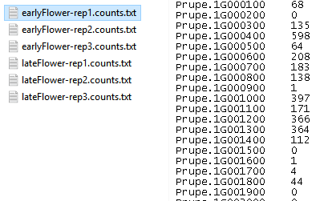

Create a deseq2 folder and change the path below to point to it.

```{r warning=F, message=F}
setwd("E:/UT/rnaseq_ws/2017/deseq2")
library(DESeq2)
```

## Data pre-processing
In this lab, we will use the count results after applying the same pipeline taught in the course on multiple and larger fastq files. [Download the deseq_data.zip](https://github.com/statonlab/rnaseq_workshop/raw/master/deseq2/deseq_data.zip) file into your deseq2 folder and unzip it.

### Count data files
After running HTSeq-count, we get output files on 2-column format, where the first column contain the gene names and the second column the gene counts, or number of reads mapped to that gene. This is how they look like.



The first step is to load the files into the R session using the `DESeqDataSetFromHTSeqCount()` function, which generates an object recognized by `DESeq()`. To do so, we need to generate a table specifying the following:
* The sample name in the first column, 
* The count file name on the second column 
* Metadata on the remaining columns

We are going to collect all this information from the file names.

```{r}
## get file names
fileName <- list.files(path = "./countData/", pattern = "*.txt")
fileName

## get sample names
sampleName <- sapply(strsplit(fileName, "[.]"), "[[", 1)
sampleName

## get phenotypes
pheno <-  sapply(strsplit(fileName, "-"), "[[", 1)
pheno <- as.factor(pheno)
pheno

## build the sample table
mySampleTable <- data.frame(sampleName, fileName, pheno)
mySampleTable
```

With this table, we are ready to load the count data.

### DESeqDataSet object: the data structure that `DESeq()` can recognize

The core function for differential analysis is `DESeq()`. But before we can use it, we need to preprocess our data so that the `DESeq()` function can recognize it.

```{r}
## get DESeqDataSet object
myDESeqData <- DESeqDataSetFromHTSeqCount(sampleTable = mySampleTable, 
                                         directory = './countData', design = ~pheno)
myDESeqData
```


After loading our files, we'll have a data matrix showing gene expression levels, with genes in rows and samples in columns

* 26873 genes
* Two genotypes with distinct phenotypes
* Each genotype has 3 clonal replicates

```{r}
head(counts(myDESeqData))
```

### Pre-filtering
Filtering of low count data is not necessary to run DESeq, but it can reduce memory usage in cases where large data files are being used.

```{r}
dim(myDESeqData)
myDESeqData <- myDESeqData[ rowSums(counts(myDESeqData)) > 1, ]
dim(myDESeqData)
```


## Differential expression analysis

* The necessary steps for differential expression analysis are wrapped into a single function `DESeq()`.
* Results are extracted using `results()`.

```{r}
myDESeq.Res <- DESeq(myDESeqData)
myRes <- results(myDESeq.Res, alpha=0.05)
summary(myRes)
myRes
```

### Cases where NA values appear
* In cases where all samples have zero counts, log2FoldChange, pvalue and padj will be NA. We won't see that here because we already filtered out these genes
* When a sample has an extreme count outlier, the pvalue and padj will also be NA
* Genes with low mean normalized counts are filtered out by automatic independent filtering and padj is NA.

The goal is to filter out tests that have no or little chance of showing significant evidence
    + This filtering results in increased detection power at the same False Discovery Rate (FDR, also type I error)
    + Independent filtering can be turned off in `DESeq()`

### p-value, adjusted p-value (padj)  and alpha

On the results table, p-values are calculated with a single test. These need to be adjusted to control for type I error (False Discovery Rate) with multiple testing. By default, `DESeq()` applies the Benjamini-Hochberg procedure (BH). The result of multitesting are adjusted p-values, which are used to determine significant genes when they are below a cutoff. By default, FDR cutoff `alpha` is set to 0.1, although it can be modified in `results()`

```{r}
pvalues <- subset(myRes, !is.na(padj))[,'pvalue']
my.padj <- p.adjust(pvalues, method='BH') ## calculate adjusted p-value
my.padj[1:30] ## compare your adjusted p-values with the values from the results table
subset(myRes, !is.na(padj))[,'padj'][1:30]
```

### Visualization of expression data after DESeq
The function plotMA shows the log2 fold changes, coloring points in red if the adjusted p-value is less than 0.05.

```{r}
plotMA(myRes, main="lateFlower vs earlyFlower", ylim=c(-8,8))
```

## Export results into a tab separated file
Here, we are going to export significant results only.
```{r}
myRes.sig <- subset(myRes, padj < 0.05)
myRes.sig
```
To complement the differential expression results, annotations are added to each row. The annotation data table is loaded using `read.csv()`. It is a tab separated file with many empty fields.
* When `header` equals `TRUE`, the names on the first row are used as column names

```{r}
## load annotation data
anno <- read.csv("Ppersica_298_v2.1.annotation_info.txt", header=TRUE, sep="\t", stringsAsFactors = F)
head(anno)
```

The annotation file contains multiple rows for many genes on `locusName`. We need to get rid of the extra rows before merging the annotation with our differential expression results. We subset the annotation table `anno` for those rows that do not contain duplicated locus names.

```{r}
## keep first row for each unique gene in locusName
anno <- anno[!duplicated(anno[,2]),]
head(anno)
```

We are ready to merge the tables. We need to convert the DESeq object with our results to a `data.frame` object and select the column on each file that contains the name to use for merging. Also, we need to specify to print all the rows from our results whether they are present in the second file with `all.x = TRUE`, and not to print non-matched lines in the second file with `all.y = FALSE`.

Finally, results are exported to a file separated with tab. This file will contain quoted names; to remove them, you can add the option `quote = ""`.

```{r}
## add annotations as new columns to our results
myRes.anno <- merge(as.data.frame(myRes.sig), anno, by.x = "row.names", by.y = "locusName", all.x = TRUE, all.y = FALSE)

## write annotated results to table
write.table(myRes.anno, file="myRes_sig.txt", sep = "\t", row.names = F)
```

This file can be opened in Excel.

---
> ### Further exploration of results
> We have exported our annotated results into a plain text that can be easily used. The full set contains ~4000 results. > This can be difficult to interpret, so here are some options you can try to reduce this set.
> * Subset the significant genes using a more stringent padj value.
> * Select up- and down-regulated genes in separate files.
> * Filter out genes below a fold change threshold

> Also, you can look at different information on you sets of DE genes
> * The total number of genes on each set
> * The range of p-values
> * The average fold change
---

## Visualization after differential expression
### Data transformation
* Gene expression data usually has inconsistent variance
* The variance is usually very high for count data when the mean is low
* Transformation methods are applied to remove the dependence of the variance on the mean
* They are useful for graphical visualization or clustering

### Transformation methods
Common transformations produce transformed data on the log2 scale which has been normalized with respect to library size. These are:
    + Regularized logarithm transformation
    + Variance stabilizing transformation, so that the variance becomes constant relative to the mean

```{r}
rl.myDESeqData <- rlog(myDESeqData, fitType = "mean")
vsd.myDESeqData <- varianceStabilizingTransformation(myDESeqData, fitType = "mean")
```

---
> The next visualization steps will use the data transformed with regularized logarithm
> * How much do the plots change when using variance stabilizing transformation?
>
> Tip: you can plot multiple panels at a time in R, for example using `par(mfrow=c(1,2))`. This may not work with all plotting functions.
---

### Sample and gene clustering using heatmap
```{r}
## select count data only for the top 50 significant genes
rl.heatmap <- assay(rl.myDESeqData[rownames(myRes.sig[order(myRes.sig$padj), ])[1:50], ]) 

library(pheatmap)
pheatmap(rl.heatmap)
```

### Heatmap of the sample-to-sample distances
The distance between samples can be calculated using the `dist()` function of the transpose of the transformed count matrix. The heatmap shows the similarities between samples.
```{r}
sampleDists <- dist(t(assay(rl.myDESeqData)))
sampleDistMatrix <- as.matrix(sampleDists)
colnames(sampleDistMatrix) <- NULL
my_palette <- colorRampPalette(c( "Blue", "white"))(n = 100)
pheatmap(sampleDistMatrix, col=my_palette)
```

### Principal Component Analysis (PCA) plot of samples
This is another option to see distance of samples.

```{r}
plotPCA(rl.myDESeqData[rownames(myRes.sig), ], intgroup="pheno")
```

## Saving R workspace
After finishing, saving some results of the analysis into a file facilitates continuing with the analysis at another time point. Multiple R objects can be specified, separated by commas.

```{r}
save(myRes, file = "deseqRes.RData")
# load(file="deseqRes.RData")
```

## Preparing results for GO enrichment analysis
On the annotation file, there is a column with GO terms. GO enrichment can be done using the whole set of gene GO term annotations as reference to compare with the set of GO terms in our DEG. Next, we are going to process the GO terms contained in `anno` and `myRes.anno` in the format specified by the online tool [AgriGO](http://bioinfo.cau.edu.cn/agriGO/). 
* First column is an ID
* Second column is a GO accession

On the annotation, there are genes with more than one GO accesion, separated by commas. We need to print one gene and one GO per line.
* `strsplit` creates lists with the result of splitting a character string by the `split` character
* `rep` is for replicate, print multiple copies of values in a vector
    + The vector to replicate contains the locus Names
    + The repeat times is given by counting the number of GO/locus after the split
* `unlist` simplifies a list structure into a simple vector

```{r}
head(anno$GO)
## print one gene and GO per line for the annotation file
s <- strsplit(anno$GO, split = ",")
anno.go <- data.frame(locus = rep(anno$locusName, sapply(s, length)), GO = unlist(s))
write.table(anno.go, file="go_ref_anno.txt", sep = " ", quote = F , row.names = F, col.names = F)

## check the column with locus names on myRes
head(myRes.anno, 2)
## print one gene and GO each line for my results
s <- strsplit(myRes.anno$GO, split = ",")
myRes.go <- data.frame(locus = rep(myRes.anno$Row.names, sapply(s, length)), GO = unlist(s))
write.table(myRes.go, file="go_myRes.txt", sep = " ", quote = F, row.names = F, col.names = F)
```

With these two files, we are ready to move into [AgriGO](http://bioinfo.cau.edu.cn/agriGO/analysis.php).
Select "Customized annotation" on both boxes and paste the content of `go_myRes.txt` on top and paste or load the reference annotation at the bottom. Finally, click submit and explore the results.
